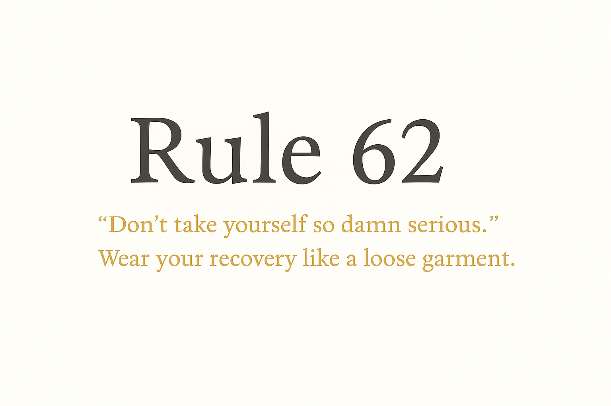

# Rule 62
> “Don’t take yourself so damn serious.”  
Wear your recovery like a loose garment.

---

### 🧭 About
“Don’t take yourself so damn serious.”
Rule 62 turns that idea into a simple, local program for anyone seeking recovery or self-improvement.
100 % open-source, completely offline, and designed to help you grow without giving up your privacy.

---

### 💡 Features
- 100% offline: all data stored locally on your computer.  
- No accounts, no cloud sync, no telemetry.  
- Step-by-step journaling and personal inventory prompts.  
- Supports any recovery or personal-change focus — not limited to substance use.  
- Optional verified donation list (mental-health charities only).

---

### ⚙️ How to Run
**Windows**
```powershell
py -3.11 -m pip install cryptography
py -3.11 rule62.py
